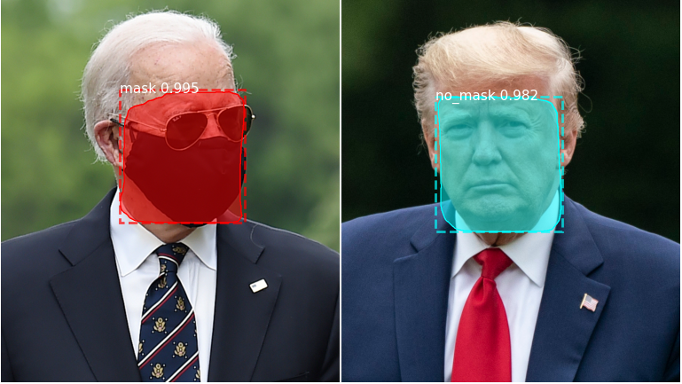

# **COVID-19: Faster R-CNN for Mask Detection**

With the ongoing global pandemic, many elected officials and medical experts have put in place policies, guidelines and protocols to keep the public safe. Mask-wearing is often recommended as a best-practice for helping mitigate the spread of the virus.

The aim of this project is to explore the use of machine learning for object-detection of masks on people's faces. Given a particular image, it should be able to detect the faces of people in the image and determine if they are wearing a mask, not wearing a mask or wearing a mask incorrectly.

---

## **About the Dataset**

The dataset is available on Kaggle under the title "Face Mask Detection". It consists of 853 images, with each image containing a variable number of people.

Each image has a corresponding annotation file in xml format that specifies the coordinates of the four corners of the bounding box indicating the location of each face, as well as the class corresponding to each box.

There are 3 classes in total that could describe any of the bounding boxes. For each face in an image, the corresponding class would indicate if the person is wearing a mask, not wearing a mask, or wearing a mask incorrectly.

---

## **Citations**

**Mask R-CNN Repository (matterport):**

    @misc{matterport_maskrcnn_2017,
    title={Mask R-CNN for object detection and instance segmentation on Keras and TensorFlow},
    author={Waleed Abdulla},
    year={2017},
    publisher={Github},
    journal={GitHub repository},
    howpublished={\url{https://github.com/matterport/Mask_RCNN}},
    }

**Mask R-CNN Repository (akTwelve)** - branched from matterport:

&nbsp;&nbsp; &nbsp; &nbsp; &nbsp; GitHub Link: <https://github.com/akTwelve/Mask_RCNN>

**Face Mask Detection Dataset:**

    @misc{make ml,
    title={Mask Dataset},
    url={https://makeml.app/datasets/mask},
    journal={Make ML}
    }
Kaggle Link: <https://www.kaggle.com/andrewmvd/face-mask-detection>

---

## **Sample Inputs**

The following is a sample consisting of 5 images from the dataset:

---

## **Model Prediction**

The following is a demonstration of the prediction on unseen images.

Inputs:

 

Outputs:

 

*** *other sample outputs can be found in the samples folder*

---

## **Make a Prediction**

1. Clone the GitHub repository
2. Install libraries in requirements.txt
3. Put images to predict in the test_images folder. Alternatively, you can put the images in a different folder and specify the folder using the argparse arguments in step 4.
4. Open terminal and run:

    python predict.py --image_path

where image_path is the directory containing the images to predict.
